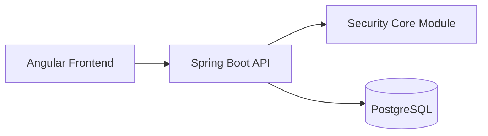

# 🎮 Grind Protocol — Frontend


Frontend oficial de **Grind Protocol**, una aplicación de productividad gamificada que convierte tareas en progreso RPG (XP, niveles, rachas y recompensas).

---

# 🌐 Visión del producto

Grind Protocol no es solo una app de tareas.

Es un sistema donde:

- 📈 **XP** = progreso real  
- 🔥 **Rachas** = disciplina  
- 🪙 **Recompensas** = motivación tangible  

---

# 🏗️ Arquitectura



---

# 🚀 Tech Stack

## Frontend
- Angular 17 (standalone)
- TypeScript (strict mode)
- SCSS + Design Tokens
- Angular Router
- Angular HttpClient
- RxJS + Signals

## Visualización
- Chart.js

---

# 🎨 Design System

| Token | Valor | Uso |
|------|------|------|
| `--primary` | #d946a8 | Acciones |
| `--xp` | #22d3ee | Progreso |
| `--streak` | #f97316 | Urgencia |
| `--currency` | #eab308 | Recompensas |
| `--bg-base` | #0a0a0c | Fondo |
| `--bg-surface` | #111116 | Cards |
| `--bg-elevated` | #16161d | Inputs |

---

# 📁 Estructura del proyecto

```
src/app/
├── core/        # Auth, HTTP, modelos
├── shared/      # Componentes reutilizables
├── layout/      # Shell, sidebar, topbar
└── features/    # Dashboard, tasks, rewards...
```

---

# ⚙️ Instalación

```bash
npm install
npm start
```

App disponible en:

```
http://localhost:4200
```

---

# 🔌 Configuración

Editar:

```
src/environments/environment.ts
```

Ejemplo:

```ts
export const environment = {
  apiUrl: 'http://localhost:8080/api'
};
```

---

# ✨ Features (MVP)

## 🔐 Auth
- Login / Register
- JWT + Refresh Token
- Interceptor automático

## 📊 Dashboard
- Progreso diario
- Calendario de racha
- Gráfico de XP
- Timeline de actividad

## ✅ Tasks
- Crear tareas
- Completar tareas
- XP dinámico

## 🎁 Rewards
- Tienda de recompensas
- Coste en Core Points
- Confirmación de compra

## 👤 Perfil
- Nivel
- Estadísticas
- Progreso

## 🚨 Alerts
- Alertas inteligentes

## 📜 Timeline
- Eventos filtrables

---

# 🧩 Componentes clave

| Componente | Descripción |
|-----------|------------|
| gp-daily-ring | Progreso circular |
| gp-xp-progress-bar | Barra XP |
| gp-streak-calendar | Racha |
| gp-task-card | Tarea |
| gp-reward-card | Recompensa |
| gp-alert-banner | Alertas |
| gp-confirm-modal | Confirmación |

---

# 🧠 Filosofía UX

- Dark UI minimalista
- Estética RPG moderna
- Feedback inmediato
- Progreso siempre visible

---

# 🔧 Scripts

```bash
npm start
npm run build
npm test
npm run watch
```

---

# 🧪 Testing (pendiente)

- Unit tests (Jest / Karma)
- Component testing
- E2E (Cypress)

---

# 🚧 Roadmap

## Corto plazo
- Integración backend real
- Manejo global de errores
- Persistencia de sesión

## Medio plazo
- Notificaciones
- Mejoras UX
- Animaciones avanzadas

## Largo plazo
- Social (rankings)
- Multiplataforma
- Gamificación avanzada

---

# 🔐 Backend relacionado

- Grind Protocol API
- Security Core (JWT, sesiones, rate limiting)

---

# 📦 Deploy

Pendiente:
- Dockerización
- CI/CD (GitHub Actions)
- Reverse proxy (Nginx)

---

# 👤 Autor

**David Ruiz**

Backend Engineer | API & Systems

---

# ⭐ Filosofía final

> “No gestionas tareas. Subes de nivel.”
